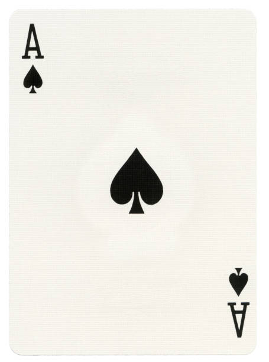
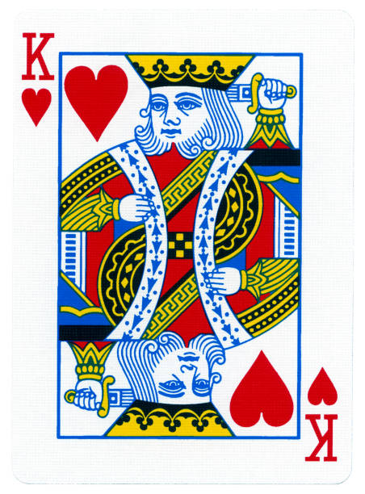

# 🃏 Classification des Cartes avec PyTorch

🔍 Ce projet utilise **PyTorch** et **Deep Learning** pour classifier des images de cartes à jouer 🎴.  
Tout le code est contenu dans un **notebook Jupyter** pour faciliter l'expérimentation et la visualisation des résultats.  

---

## 🚀 **Aperçu du Projet**
Ce projet inclut :  
✅ Prétraitement des images avec `torchvision.transforms` 📸  
✅ Chargement des données avec `DataLoader et Dataset` 🗂  
✅ Entraînement d’un modèle PyTorch 🔥  
✅ Évaluation des performances 📊  
✅ Visualisation des prédictions 🎨  

📌 **Exemple d’image de test :**
| Image | Prédiction |
|-------|-----------|
|  | ♠️ As de Pique |
|  | ♥️ Roi de Cœur |

---